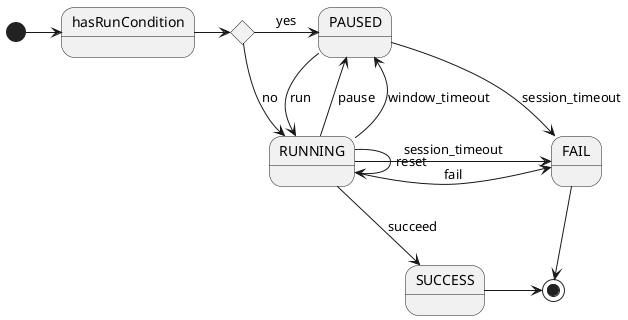

# 작업 플로우

## 1. 개요

### 요약

- 작업세션은 CDM을 처리하는 주체로써 PAUSED, RUNNING, SUCCESS, FAIL 상태를 갖습니다
- 작업세션 상태는 run, pause, succeed, fail, reset, window_timeout, session_timeout 조건에 의해 변경됩니다.
- 작업세션으로 CDM이 입력되면, 현재 상태의 조건을 처리하여 결과를 컨텍스트에 저장하고 다음 상태로 변경됩니다.

### 상태

- 상태는 PAUSED 또는 RUNNING로 시작하여, SUCCESS 또는 FAIL로 종료됩니다.
- 선행 조건을 만족후에 메인 조건을 처리해야 하는 경우에는, run(=선행 조건)을 설정하여 PAUSED로 시작할 수 있습니다.
- PAUSED에서 run(=선행 조건)을 만족하면 RUNNING으로 변경되며, RUNNING에서 succeed(=메인 조건)을 만족하면 SUCCESS로 종료됩니다.

### 조건

- 조건은 필터(filter)와 연산(operations)으로 구성됩니다.
- 여러개의 필터를 조합하여 필터할 수 있으며, 여러개의 연산을 순서대로 연산하여 결과를 만들어냅니다.

### 컨텍스트

- 조건의 결과는 컨텍스트에 저장(영속화)됩니다
- 컨텍스트를 참조하여 같은 조건의 후속 연산, 같은 작업세션의 후속 CDM 처리에서 피연산자로 사용할 수 있습니다.
- 여러 조건의 결과가 네임스페이스로 구분하여 저장됩니다.

### 피드백

- 작업세션의 컨텍스트에 변경이 있으면 피드백으로 발행됩니다.

## 2. 상태 흐름

### 다이어그램



### PAUSED

- 메인 조건을 처리하기전에 선행 조건을 처리하는 동안의 상태입니다.
- run 조건(=선행 조건)을 만족하면, RUNNING 상태가 됩니다
- session_timeout 조건을 만족하면, FAIL 상태로 종료됩니다

### RUNNING

- 메인 조건을 처리하는 동안의 상태 입니다.
- succeed 조건(=메인 조건)을 만족하면, SUCCESS 상태로 종료됩니다
- fail, session_timeout 조건을 만족하면, FAIL 상태로 종료됩니다
- pause 조건을 만족하면, PAUSED 상태가 됩니다.
- window_timeout 조건을 만족하면, 현재 상태값을 초기화 하면서 PAUSED 상태가 됩니다
- reset 조건을 만족하면, 현재 상태값을 초기화 하고, RUNNING 상태를 유지합니다

### SUCCESS

- SUCCESS 종료된 상태 입니다
- 더이상 상태가 변경되지 않습니다.

### FAIL

- FAIL 종료된 상태 입니다
- 더이상 상태가 변경되지 않습니다.

## 3. 작업 플로우

작업세션의 상태를 변경하는 조건들은 연산자(operator)와 피연산자(operands)로 정의된 작업 플로우(DSL)로 정의합니다.

### 피연산자 (operand)

#### cdm

- CDM을 피연산자로 사용합니다.
- value에는 CDM(=$)의 특정 필드를 JSONPath 표현식으로 지정합니다.

```
{
  "source":"cdm", 
  "type":"string", 
  "value":"$.char.name" // $ = cdm 객체
}
```

#### context

- 컨텍스트에는 연산 결과가 저장되며, 이를 다른 연산의 피연산자로 사용할 수 있습니다
- value에는 컨텍스트(=$)의 특정 필드를 JSONPath 표현식으로 지정합니다.
- 기본적으로 현재 처리중인 조건의 네임스페이스에 접근하며, option을 통해 다른 조건의 네임스페이스에 접근할 수 있습니다

```
{
    "source":"context",   
    "type":"string", 
    "value":"$.counter" // $ = context 객체 (네임스페이스 = 현재 조건)
}
```

```
{
  "source":"context", 
  "type":"string", 
  "value":"$.counter" // $ = 컨텍스트 객체 (네임스페이스 = run)
  "options":{ "context_namespace":"run" }
}
```

#### constant

- 상수값을 피연산자로 사용합니다.
- value에는 상수값을 지정합니다.

```
{
  "source":"constant", 
  "type":"string", 
  "value":"hello"
}
```

### 비교 연산자 (comparison operator)

| 연산자          | 설명                                                         |
|-----------------|--------------------------------------------------------------|
| equal         | 2개의 피연산자가 서로 같은지 확인합니다                      |
| not_equal     | 2개의 피연산자가 서로 다른지 확인합니다                      |
| greater_than  | 피연산자 #1이 피연산자 #2보다 큰지 확인합니다                |
| less_than     | 피연산자 #1이 피연산자 #2보다 작은지 확인합니다              |
| greater_than_equal | 피연산자 #1이 피연산자 #2보다 크거나 같은지 확인합니다  |
| less_than_equal    | 피연산자 #1이 피연산자 #2보다 작거나 같은지 확인합니다  |
| has_all_key   | 피연산자 객체가 지정된 Key를 모두 가지고 있는지 확인합니다   |
| has_any_key   | 피연산자 객체가 지정된 Key를 하나 이상 가지고 있는지 확인합니다 |

### 변환 연산자 (transformation operator)

| 연산자          | 설명                                                         |
|-----------------|--------------------------------------------------------------|
| substring       | 피연산자의 start_index ~ end_index를 잘라내어 컨텍스트의 id에 저장합니다 |
| projection      | 피연산자의 Key, Value를 컨텍스트의 id에 저장합니다 |

### 집계 연산자 (aggregation operator)

| 연산자          | 설명                                                         |
|-----------------|--------------------------------------------------------------|
| count         | 피연산자가 존재하면, 컨텍스트의 id값에 누적합니다.        |
| sum           | 피연산자의 Value를 컨텍스트의 id값에 누적합니다           |
| merge         | 피연산자의 Key, Value를 컨텍스트의 id값 객체에 병합합니다 |

### 작업 플로우(DSL)

```
{
  "session_timeout": "$session_timeout_seconds", 
  "window_timeout": "$window_timeout_seconds",
  "conditions": {
    "run": {
      "cdm": "$cdm_name",
      "filter": {/*filter*/},
      "operations": [/*operations*/]
    },
    "pause": {
      "cdm": "$cdm_name",
      "filter": {/*filter*/},
      "operations": [/*operations*/]
    },
    "succeed": {
      "cdm": "$cdm_name",
      "filter": {/*filter*/},
      "operations": [/*operations*/]
    },
    "fail": {
      "cdm": "$cdm_name",
      "filter": {/*filter*/},
      "operations": [/*operations*/]
    },
    "reset": {
      "cdm": "$cdm_name",
      "filter": {/*filter*/},
      "operations": [/*operations*/]
    }
  }
}
```

### 여러개의 필터를 조합하여 필터할 수 있습니다

- A, B, C 3개의 필터를 정의하고, (A or B) and C 조합하여 필터합니다

```
{
  "expression": "(A | B) & C",
  "items": {
    "A": {/*filter*/},
    "B": {/*filter*/},
    "C": {/*filter*/}
  }
}
```

### 여러개의 연산을 순서대로 연산하여 결과를 만듭니다

- 첫번째 sum 연산에서 결과를 "result" 필드에 누적합니다
- 두번째 equal 연산에서 컨텍스트($)의 "result" 필드가 10인지 확인합니다

```
[
  {
    "context_key": "$.result1", // sum 결과를 저장할 컨텍스트 KEY
    "operator": "sum",
    "operands": [/*operands*/]
  },
  {
    "context_key": "$.result2", // equal 결과를 저장할 컨텍스트 KEY
    "operator": "equal",
    "operands": [
      {
        "source": "context", 
        "type": "number",
        "value": "$.result1" // // sum 결과과 저장되어 있는 컨텍스트 KEY를 참조
      },
      {
        "source": "constant", 
        "type": "number",
        "value": "50"
      }
    ]
  }
]
```

## 4. 작업 플로우 예시

### 필터 조합 예시

- (color == red or color == blue) and level >= 100

```
{
  "expression": "(A | B) & C",
  "items": {
    "A": {
      "operator": "equal",
      "operands": [
        {
          "source": "cdm",
          "type": "string",
          "value": "$.color"
        },
        {
          "source": "constant",
          "type": "string",
          "value": "red"
        }
      ]
    },
    "B": {
      "operator": "equal",
      "operands": [
        {
          "source": "cdm",
          "type": "string",
          "value": "$.color"
        },
        {
          "source": "constant",
          "type": "string",
          "value": "blue"
        }
      ]
    },
    "C": {
      "operator": "greater_than_equal",
      "operands": [
        {
          "source": "cdm",
          "type": "number",
          "value": "$.level"
        },
        {
          "source": "constant",
          "type": "number",
          "value": "100"
        }
      ]
    }
  }
}
```

### equal 연산 예시

```
-- DSL --
[
  {
    "context_key": "$.checker",
    "operator": "equal",
    "operands": [
      {
        "source": "cdm",
        "type": "string",
        "value": "$.map_name"
      },
      {
        "source": "constant",
        "type": "string",
        "value": "dungeon#1234"
      }
    ]
  }
]
```

```
-- sample --
input_cdm.{"map_name":"dungeon#1234"} --> context.{"checker": true}
```

### projection 연산 예시1

- key를 지정하지 않으면 컨텍스트 id에 값을 저장합니다

```
-- DSL --
[
  {
    "context_key": "$.map_name",
    "operator": "projection",
    "operands": [
      {
        "source": "cdm",
        "type": "string",
        "value": "$.map_info.name"
      }
    ]
  }
]
```

```
-- sample --
input_cdm.{
  "map_info": {
    "name": "dungeon#1234", 
  }
} --> context.{
  "map_name": "dungeon#1234",
}
```

### projection 연산 예시2

- key를 지정하면 컨텍스트 id의 값 객체에 해당 Key로 저장합니다

```
-- DSL --
[
  {
    "context_key": "$.projection.map_name",
    "operator": "projection",
    "operands": [
      {
        "source": "cdm",
        "type":"string", 
        "value":"$.name"
      }
    ]
  }
]
```

```
-- sample --
input_cdm.{
  "map_info": {
    "name": "dungeon#1234", 
  }
} --> context.{
  "projection": {
    "map_name": "dungeon#1234",
  }
}
```

### sum + equal 연산 예시

```
-- DSL --
[
  {
    "context_key": "$.result", 
    "operator": "sum",
    "operands": [
      {
        "source": "cdm",
        "type": "number",
        "value": "$.quantity"  
      }
    ]
  },
  {
    "context_key": "$.checker",
    "operator": "equal",
    "operands": [
      {
        "source": "context", 
        "type": "number",
        "value": "$.result"
      },
      {
        "source": "constant",
        "type": "number",
        "value": "10"
      }
    ]
  }
]
```

```
-- sample --
input_cdm.{"quantity":2} --> context.{"result": 2, "checker": false}
input_cdm.{"quantity":4} --> context.{"result": 6, "checker": false} // =2+4
input_cdm.{"quantity":1} --> context.{"result": 7, "checker": false} // =6+1
input_cdm.{"quantity":3} --> context.{"result": 10, "checker": true} // =7+3
```

### merge + has_all_key 연산 예시1

- options.operate_when_has_value:true 설정된 연산은 피연산자의 값이 존재할 때만 쓰기를 합니다. (기본값은 true 입니다)

```
-- DSL --
[
  {
    "context_key": "$.result.head",
    "operator": "merge",
    "operands": [
      {
        "source": "cdm",
        "type":"string", 
        "value":"$.head",
        "options": {"operate_when_has_value": true /*default=true*/}
      }
    ]
  },
  {
    "context_key": "$.result.body",
    "operator": "merge",
    "operands": [
      {
        "source": "cdm",
        "type":"string", 
        "value":"$.body"
      }
    ]
  },
  {
    "context_key": "$.result.foot",
    "operator": "merge",
    "operands": [
      {
        "source": "cdm",
        "type":"string", 
        "value":"$.foot"
      }
    ]
  },
  {
    "context_key": "$.checker",
    "operator": "has_all_key",
    "operands": [
      {
        "source": "context", 
        "type":"object", 
        "value":"$.result" 
      },
      {
        "source": "constant",
        "type":"array", 
        "value":["head", "body", "foot"]
      }
    ]
  }
]
```

```
-- sample --
input_cdm.{"head":"head"} --> context.{
  "result":{"head":"head"}, 
  "checker":false
}
input_cdm.{"body":"body"} --> context.{
  "result":{"head":"head", "body":"body"}, 
  "checker":false
}
input_cdm.{"foot":"foot"} --> context.{
  "result":{"head":"head", "body":"body", "foot":"foot"}, 
  "checker":true
}
```

### merge + has_all_key 연산 예시2

- options.context_key_postfix를 설정하면, 피연산자의 특정 필드를 컨텍스트키에 추가합니다.

```
-- DSL --
[
  {
    "context_key": "$.result", 
    "operator": "merge",
    "operands": [
      {
        "source": "cdm",
        "type":"string", 
        "value":"$.data"
        "options": {"context_key_postfix": "$.type"}
      }
    ]
  },
  {
    "context_key": "$.checker",
    "operator": "has_all_key",
    "operands": [
      {
        "source": "context", 
        "type":"string", 
        "value":"$.result" 
      },
      {
        "source": "constant",
        "type":"array", 
        "value":["head", "body", "foot"]
      }
    ]
  }
]
```

```
-- sample --
input_cdm.{"type":"head", "data":"head"} --> context.{
  "result":{"head":"head"}, 
  "checker":false
}
input_cdm.{"type":"body", "data":"body"} --> context.{
  "result":{"head":"head", "body":"body"}, 
  "checker":false
}
input_cdm.{"type":"foot", "data":"foot"} --> context.{
  "result":{"head":"head", "body":"body", "foot":"foot"}, 
  "checker":true
}
```

### projection + substring + merge 연산 예시3 (일자별 최초 접속시간)

- options.persistence:false 설정된 연산 결과는 컨텍스트를 영속화할 때 제외됩니다.
- options.write_when_not_exists:true 설정된 연산은 key가 존재하지 않을때만 적용됩니다.

```
-- DSL --
[
  {
    "context_key": "datetime", 
    "operator": "projection",
    "options": {"persistence": false /*default=true*/},
    "operands": [
      {
        "source": "cdm", 
        "type":"string", 
        "value":"$.datetime"
      }
    ]
  },
  {
    "context_key": "date", 
    "operator": "substring",
    "options": {"persistence": false /*default=true*/},
    "operands": [
      {
        "source": "context",
        "type":"string", 
        "value":"$.datetime", 
        "options": {"start":0, "end":10}
      }
    ]
  },
  {
    "context_key": "attendance", 
    "operator": "merge",
    "options": {"write_when_not_exists": true /*default=false*/},
    "operands": [
      {
        "source": "context",
        "type":"string", 
        "key":"$.date", 
        "value":"$.datetime"
      }
    ]
  }
]
```

```
-- sample --
input_cdm.{"datetime":"2024/09/27 12:12:22"} --> context.{
  "datetime":"2024/09/27 12:12:22",
  "date":"2024/09/27",
  "attendance":{
    "2024/09/27":"2024/09/27 12:12:22" 
  } 
} --> feedback.{
  "attendance":{
    "2024/09/27":"2024/09/27 12:12:22" 
  } 
}
input_cdm.{"datetime":"2024/09/27 12:13:31"} --> context.{
  "datetime":"2024/09/27 12:13:31",
  "date":"2024/09/27",
  "attendance":{
    "2024/09/27":"2024/09/27 12:12:22" // not changed (=no feedback)
  } 
} 
input_cdm.{"datetime":"2024/09/28 09:01:51"} --> context.{
  "datetime": "2024/09/28 09:01:51",
  "date":"2024/09/28",
  "attendance":{
    "2024/09/27":"2024/09/27 12:12:22",
    "2024/09/28":"2024/09/28 09:01:51" 
  } 
} --> feedback.{
  "attendance":{
    "2024/09/27":"2024/09/27 12:12:22",
    "2024/09/28":"2024/09/28 09:01:51" 
  } 
}
input_cdm.{"datetime":"2024/09/28 09:22:42"} --> context.{
  "datetime":"2024/09/28 09:22:42",
  "date":"2024/09/28",
  "attendance":{
    "2024/09/27":"2024/09/27 12:12:22",
    "2024/09/28":"2024/09/28 09:01:51" // not changed (=no feedback)
  } 
} 
```
