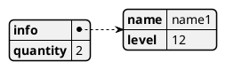
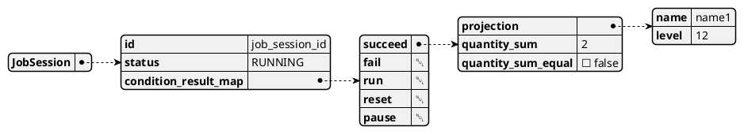
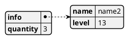

아래는 cdm.quantity 필드의 합계가 10인지 확인하는 작업플로우 연산 예제입니다.

```json
{
  "session_timeout": "$session_timeout_seconds",
  "window_timeout": "$window_timeout_seconds",
  "conditions": {
    "succeed": [
      {
        "id": "projection",
        "operator": "projection",
        "operands": [
          {
            "source": "cdm",
            "type": "string",
            "key": "name",
            "value": "$.info.name"
          },
          {
            "source": "cdm",
            "type": "number",
            "key": "level",
            "value": "$.info.level"
          }
        ]
      },
      {
        "id": "quantity_sum",
        "operator": "sum",
        "operands": [
          {
            "source": "cdm",
            "type": "number",
            "value": "$.quantity"
          }
        ]
      },
      {
        "id": "quantity_sum_equal",
        "operator": "equal",
        "operands": [
          {
            "source": "context",
            "type": "number",
            "value": "$.quantity_sum"
          },
          {
            "source": "constant",
            "type": "number",
            "value": 5
          }
        ]
      }
    ]
  }
}
```

위 succeed 조건에 대해서 아래 CDM을 처리한 JobSession은 아래와 같은 데이터 모델을 갖습니다.

cdm-#1 처리


cdm-#1 처리 후 JobSession의 상태는 아래와 같습니다.
("succeed" Key에 저장된 {...} 객체가 컨텍스트 모델 입니다.) 


cdm-#2 처리

cdm-#2 처리 후 JobSession의 상태는 아래와 같습니다.


